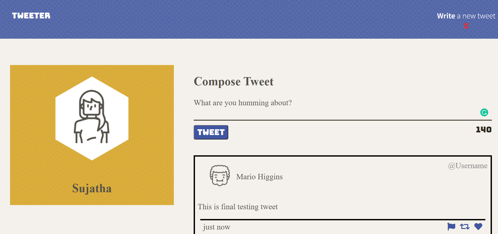
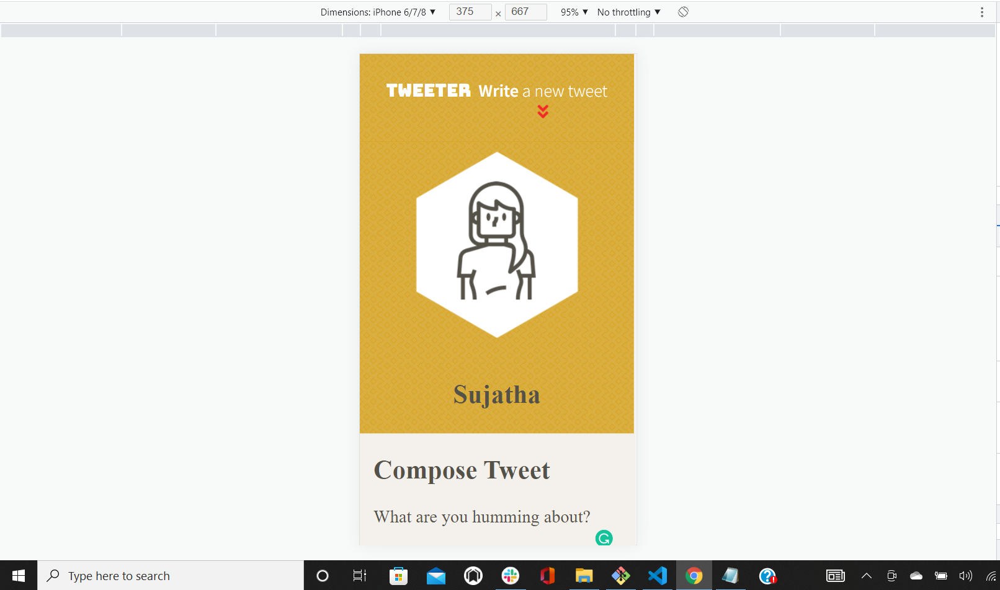
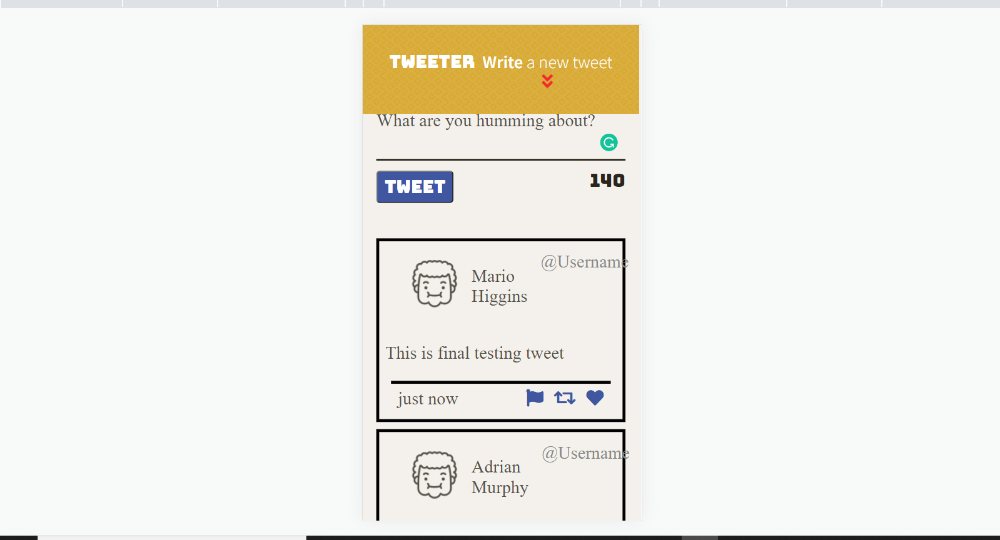
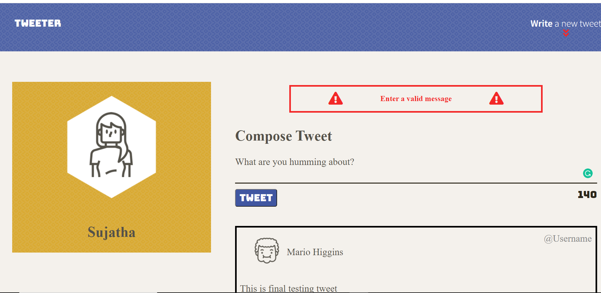
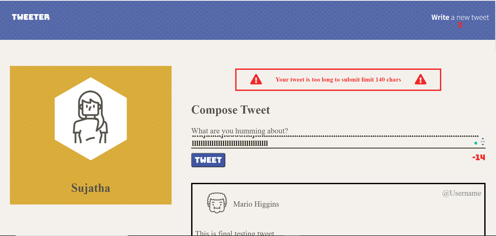

# Tweeter Project
Tweeter is a simple, single-page Twitter clone.

Short and powerful tweets! Stay under 140 characters, and you'll be fine. Works well across all platforms.

This repository is the starter code for the project: Students will fork and clone this repository, then build upon it to practice their HTML, CSS, JS, jQuery and AJAX front-end skills, and their Node, Express back-end skills.

## Getting Started

1. [Create](https://docs.github.com/en/repositories/creating-and-managing-repositories/creating-a-repository-from-a-template) a new repository using this repository as a template.
2. Clone your repository onto your local device.
3. Install dependencies using the `npm install` command.
3. Start the web server using the `npm run local` command. The app will be served at <http://localhost:8080/>.
4. To run the Sass files `sass-watch` command.
5. Go to <http://localhost:8080/> in your browser.

## Technologies Used
Tweeter is a Front-end project, with focus on having a good-looking UI.This app uses HTML, CSS, SCSS, JS, jQuery and AJAX on the front-end; and Node, Express and MongoDB on the back-end.

### How To Use Tweeter
Read Tweets
Depending on what device you're on, the tweet timeline will either be under your profile picture, or to the right.

The tweets will show new to old. Scroll through and enjoy.

### Write Tweets
Simply write your thoughts in tweet field and click tweet. You will see it appear on the timeline.

### Features
Tweet validation prevents you from sending empty tweets, or those with over 140 characters.
Each tweet shows the user's name, handle, and when hovered over, social icons.

The Tweeter project will look like the images below:

## Dependencies
- Express
- Node 5.10.x or above
